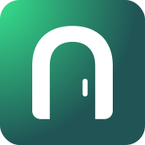
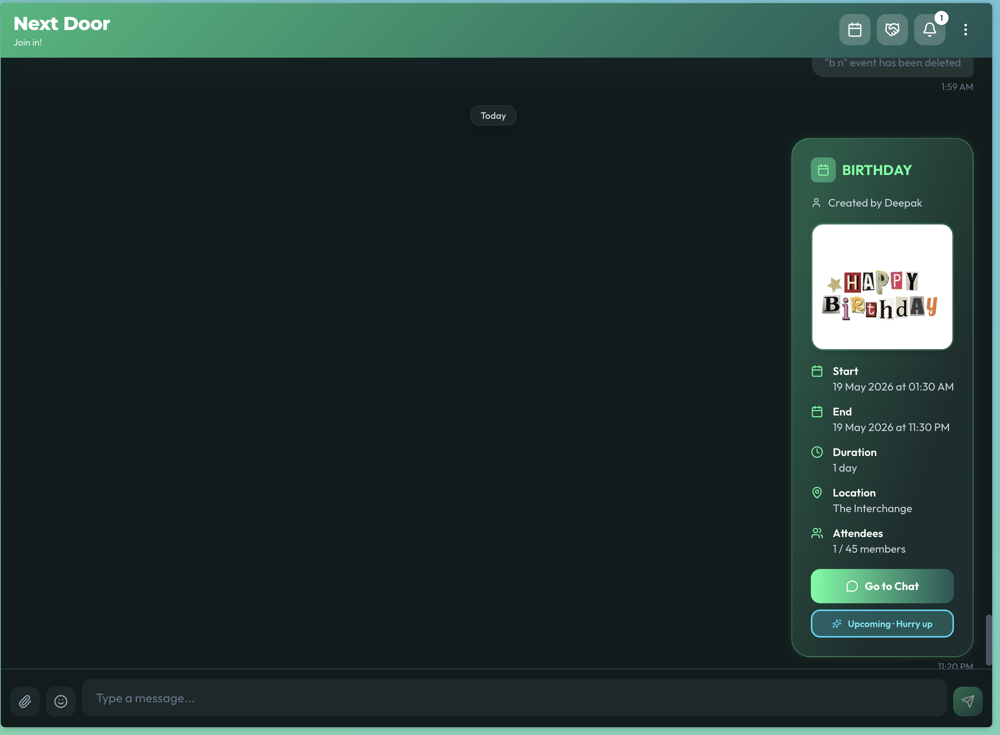
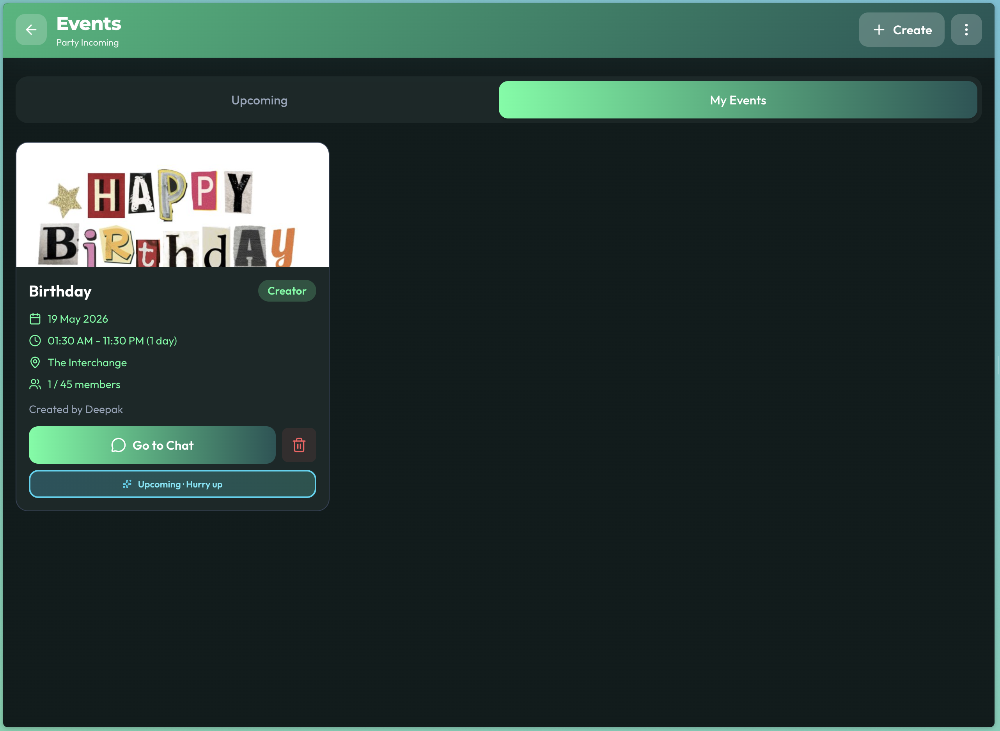
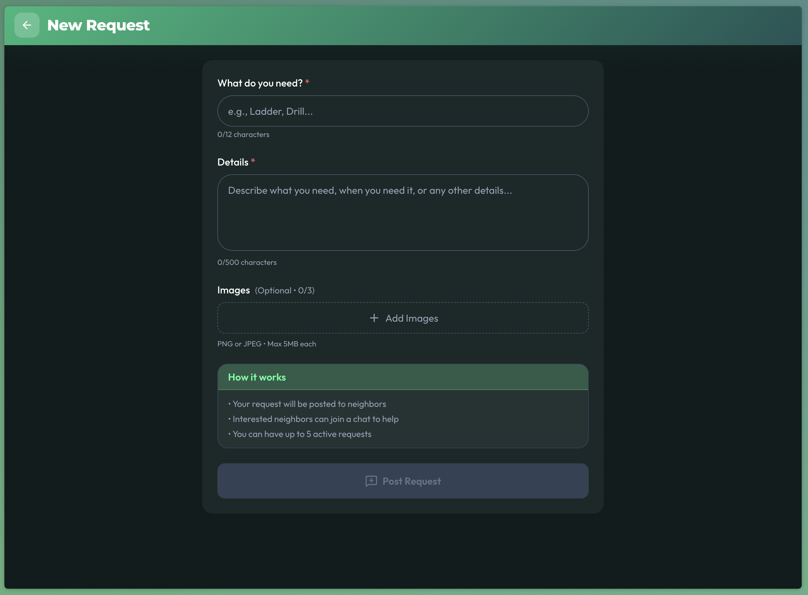
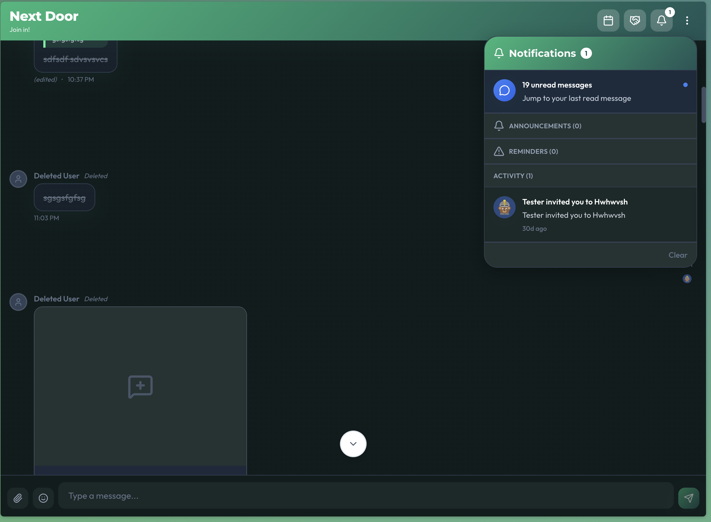
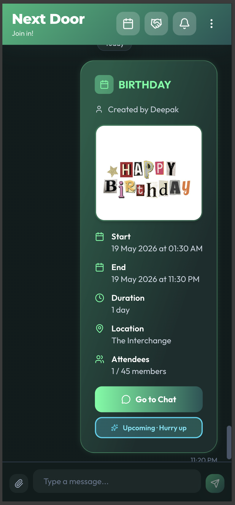

<div align="center">
  

  # Next Door

  **A private community app for your building, block, or neighbourhood.**

  [](https://nextdoor.website)
  [](https://nextjs.org/)
  [](https://supabase.com/)
  [](https://www.typescriptlang.org/)
  [](https://tailwindcss.com/)
  [](https://vercel.com/)
  [](LICENSE)

</div>

---

Next Door is a self-hosted neighbourhood community app. Deploy one instance for your apartment building, street, or local group. Members sign in with Google, chat in real time, organise events, and buy/sell/swap things — all in one place, with zero external social network involvement.

---

## Features

### Chat
- **Real-time group chat** — live message feed powered by Supabase Realtime
- **Reactions** — emoji reactions on any message via emoji picker
- **Replies** — thread replies with quoted context
- **File & image attachments** — upload photos and documents inline
- **@mentions** — autocomplete mention dropdown; notifies the mentioned user
- **Edit & delete** — members can edit or soft-delete their own messages
- **Pinned messages** — admins can pin important messages; accessible via the pin panel
- **Announcements** — time-bounded pinned announcements that auto-expire
- **Typing indicators** — see who's typing in real time
- **Read receipts** — per-message read status with avatar list
- **Message search** — full-text search across the entire chat history
- **Unread count** — badge on the tab title showing unread messages

### Events
- **Create events** — title, description, location, start/end time, capacity, cover image
- **Join / leave** — RSVP flow with member cap enforcement
- **Per-event chat** — each event gets its own isolated chat room
- **Event history** — archive panel of past events you organised or attended

### Marketplace
- **Listings** — post items as *offering* or *requesting*, with types: **Sale**, **Rent**, or **Free**
- **Image galleries** — attach multiple photos to a listing
- **Interest signalling** — members click "Interested" to queue up; creator picks a winner
- **Per-listing chat** — private negotiation thread between creator and interested parties
- **Status lifecycle** — Open → Discussion → Confirmed → Closed with transaction log
- **Rentals** — rental period tracking and return confirmation flow
- **Transaction history** — full record of completed deals

### Profiles & Users
- **Google OAuth** — one-click sign-in, no password required
- **Profile setup** — room number, display name, avatar, bio, creator link
- **Public profile pages** — view any member's profile and their activity
- **Online presence** — real-time online/offline indicator via heartbeat

### Admin
- **User management** — view, activate, deactivate, or permanently remove members
- **Email digest** — configurable weekly neighbourhood digest sent via [Resend](https://resend.com/)
- **Email schedule** — set send day, time, and recipients from the admin panel
- **Reminders** — create admin-managed reminders broadcast to all members
- **Data export** — export full user list as CSV
- **Message moderation** — clear chat history when needed

### General
- **Dark mode** — system-aware theme with manual toggle
- **Notifications** — in-app notification panel with unread badge
- **Blocked accounts** — real-time redirect for blocked or deactivated members
- **Legal pages** — Privacy Policy, Terms of Service, Cookie Policy included

---

## Tech Stack

| Layer | Technology |
|---|---|
| Framework | Next.js 14 (App Router) |
| Database + Auth | Supabase (Postgres + Realtime + Storage) |
| Language | TypeScript 5 |
| Styling | Tailwind CSS 3 |
| Email | Resend |
| Scheduling | cron-job.org (webhook-based) |
| Deployment | Vercel |

---

## Screenshots







---

## Getting Started

### Prerequisites

- Node.js 20+
- A [Supabase](https://supabase.com/) project (free tier works)
- A [Vercel](https://vercel.com/) account (free tier works)
- A [Resend](https://resend.com/) account for email (free tier works)
- A Google Cloud project with OAuth 2.0 credentials

### 1. Clone & install

```sh
git clone https://github.com/deepakkrishnar1618-svg/Next-Door-App.git
cd Next-Door-App
npm install
```

### 2. Set up Supabase

1. Create a new Supabase project
2. Open the **SQL Editor** and run `supabase/schema.sql` to create all tables
3. Run this one-time settings seed:

```sql
INSERT INTO app_settings (setting_key, setting_value) VALUES
  ('email_notifications_enabled', '1'),
  ('email_send_days', '["monday"]'),
  ('email_send_time', '09:00'),
  ('email_last_sent', '')
ON CONFLICT (setting_key) DO NOTHING;
```

4. In **Authentication → Providers**, enable **Google** and paste in your Google OAuth Client ID and Secret
5. Add your app URL to **Authentication → URL Configuration → Redirect URLs**

### 3. Configure Google OAuth

1. Go to [Google Cloud Console](https://console.cloud.google.com/) → APIs & Services → Credentials
2. Create an OAuth 2.0 Client ID (Web application)
3. Add your Vercel URL to **Authorised redirect URIs**: `https://your-domain.com/auth/callback`

### 4. Environment variables

Copy `.env.example` to `.env.local` and fill in the values:

```sh
cp .env.example .env.local
```

| Variable | Where to find it |
|---|---|
| `NEXT_PUBLIC_SUPABASE_URL` | Supabase → Settings → API |
| `NEXT_PUBLIC_SUPABASE_ANON_KEY` | Supabase → Settings → API |
| `SUPABASE_SERVICE_ROLE_KEY` | Supabase → Settings → API (keep secret — server-only) |
| `NEXT_PUBLIC_APP_URL` | Your Vercel deployment URL |
| `ADMIN_EMAIL` | The Google email that should get admin access on first sign-in |
| `RESEND_API_KEY` | Resend → API Keys |
| `CRON_WEBHOOK_SECRET` | Any random string — used to authenticate cron webhooks |

### 5. Deploy to Vercel

```sh
npx vercel
```

Or connect the repo in the Vercel dashboard and set the environment variables there.

### 6. Set up cron jobs (optional — for email digest + cleanup)

Create three jobs at [cron-job.org](https://cron-job.org):

| Job | URL | Schedule | Method | Header |
|---|---|---|---|---|
| Cleanup | `https://your-domain.com/api/cron/cleanup` | Every 15 min | POST | `x-webhook-secret: <your secret>` |
| Email digest | `https://your-domain.com/api/cron` | Every 15 min | POST | `x-webhook-secret: <your secret>` |
| Purge guests | `https://your-domain.com/api/cron/purge-guests` | Once a day | POST | `x-webhook-secret: <your secret>` |

The email digest handler checks the admin-configured schedule internally — running the cron every 15 minutes is safe. Purge guests removes anonymous (Guest Access) accounts older than `GUEST_TTL_HOURS` (default 24).

---

## Local Development

```sh
npm run dev
```

App runs at `http://localhost:3000`. You'll need a Supabase project and a `.env.local` with real credentials (local Supabase CLI also works).

---

## First Sign-in

1. Open the app and click **Sign in with Google**
2. Sign in with the email you set as `ADMIN_EMAIL`
3. Complete the profile setup (name, room number)
4. You'll land in the main chat as an admin — go to **Settings** to configure the app

---

## License

MIT — see [LICENSE](LICENSE)
